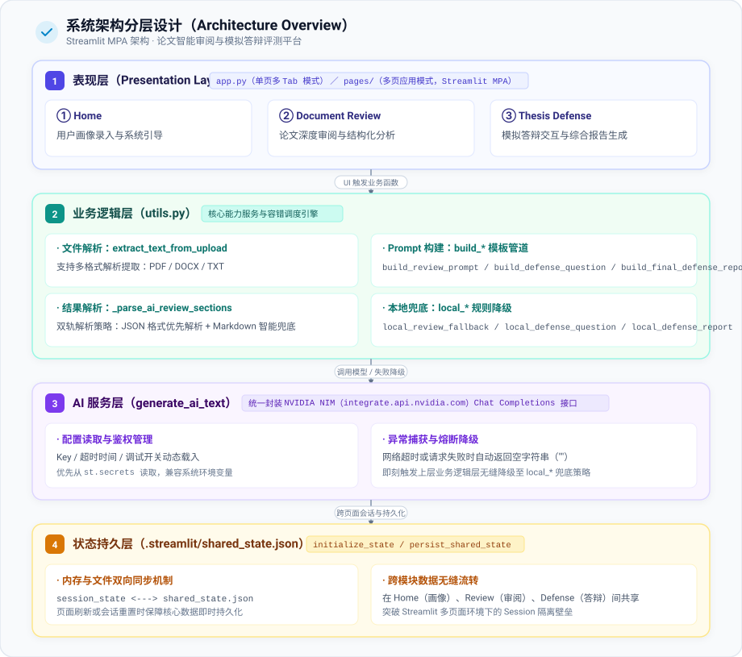

# 智能答辩助手：基于大语言模型的 AI 模拟答辩 Web 平台设计与实现

## 摘要

不管是高中生完成课题研究，还是本科生准备期末课程论文答辩，大家在备考时往往都会遇到几个很现实的痛点：平时几乎找不到专业老师帮忙做高仿真模拟演练、光靠自己反复看论文很难发现论证漏洞、也很难提前得到客观且切中要害的提问与评价。针对这些实际困难，我们以“需求调研 → 系统开发 → 方案验证 → 持续优化”为主线，设计并实现了一套轻量级的 AI 模拟答辩平台——**智能答辩助手 Thesis Defense Studio**。

我们首先通过问卷调研摸清了学生在答辩备考阶段的真实顾虑；接着基于纯 Python 与 Streamlit 构建了系统架构，借助大语言模型实现了论文全文快速审阅、虚拟评委自适应追问答辩、多维度打分以及改进建议生成等核心功能；在此基础上，针对大模型常见的生成幻觉、超长文本处理开销与上下文溢出、以及用户论文隐私安全等风险，逐一设计了针对性的工程防护策略。在业务链条上，系统梳理并打通了从“需求发起”、“AI生成”到“实操演练”的核心交互链路，并规划了“用户反馈与模型迭代”的扩展机制。实际测试与体验表明，智能答辩助手能以极低的使用门槛为学生提供随时可练、不怕出错的演练环境，有效缓解了答辩备考资源不足与临场紧张的问题。

智能答辩助手的设计和实现同时也是“LLM-as-a-Judge”这一大语言模型的技术范式在工程实践中的实际应用。

**关键词：**

- LLM-as-a-Judge
- 大语言模型
- AI 模拟答辩
- 答辩备考
- Web 系统设计

---

# 第一章 绪论

近年来，随着高中探究性课题和高校课程论文比重的提升，现场答辩和学术演讲逐渐成为考察学生学术素养的重要环节。

但在实际备考中，很多同学往往会陷入一个误区：以为论文写完了、把讲稿背熟了，答辩就十拿九稳了。然而到了现场，只要评委稍微追问几个核心问题——比如“你这个研究问题为什么值得做？”、“现有数据真的能充分支撑结论吗？”、“这个实验方法到底有哪些局限？”，很多同学就会立刻乱了阵脚：有的逻辑出现断层，有的抓不住回答重点，还有的因为过于紧张而发挥失常。

说到底，大家备考时大多只能靠反复看文档、做 PPT，很难跳出作者视角，站在“挑剔评委”的立场去挑自己文章的刺。虽然不同学段的要求各有侧重，但这种“缺少真实对手陪练”的困境是共通的。

而大语言模型（LLM）的自然语言交互与上下文推理能力，正好非常适合用来充当“陪练考官”。本项目的工作重点主要包含：

1. 深入调研学生在答辩备考中最常踩的坑与真实困难；
2. 梳理学生对论文自查和模拟答辩的具体功能期望；
3. 开发开箱即用的 Web 模拟答辩系统，提供智能审阅与多轮自适应追问；
4. 解决大模型应用中的幻觉、上下文超长以及论文隐私外泄等现实挑战；
5. 验证系统在答辩演练中的实际辅助效果。

---

# 第二章 相关技术基础

## 2.1 大语言模型（LLM）技术原理

主流的大语言模型基本都建立在 Transformer 架构之上。它最核心的优势，就是通过自注意力机制（Self-Attention）动态计算文本中各个词之间的关联权重，从而能够很好地捕捉长距离的上下文逻辑。

### 预训练

模型在海量文本上通过自监督学习，本质上就是在持续学习“根据上文预测下一个词（Next-Token Prediction）”。比如 GPT-3 就消耗了约 4100 亿 Token 的数据进行预训练，建立了深厚的语言理解和通用知识底座。

### 对齐训练

光有预训练还不够，模型容易天马行空甚至给出不合规的回答，因此还需要经过对齐（Alignment）阶段：

- **监督微调（SFT）**：通过高质量的人工问答示范数据，让模型学会理解并严格遵循用户的提问指令；
- **人类反馈强化学习（RLHF）**：进一步引入人类打分偏好来训练奖励模型，通过强化学习调整生成策略，让模型的回答更加符合人类的表达习惯、学术规范和事实逻辑。

研究表明，经过良好对齐的较小规模模型（如 1.3B 的 InstructGPT），在回答相关性和可靠度上完全可以超越未做对齐的超大模型（如 175B 的基础 GPT-3），同时有害输出明显减少，事实准确性也大幅提升。

---

## 2.2 大模型落地中的现实风险

在实际应用中，直接拿大模型来做学术评审和答辩提问，往往会遇到以下技术痛点：

### AI 幻觉（Hallucination）

模型在缺乏足够上下文支撑或推断置信度不高时，容易一本正经地编造不存在的事实或推导。这主要由于训练数据噪声、统计概率采样的随机性以及长文本生成过程中的偏差累积。

学术界目前常采用 **SelfCheckGPT**（多次采样比对一致性）、引入外部知识库检验，或者通过 **BERTScore**、QA 一致性指标等方法来检测和压制幻觉。在实际工程落地中，最有效也最直接的做法往往是收紧提示词约束，并严格将模型的推理范围框定在用户上传的文章内容里。

---

## 2.3 教育场景下的 AI 辅助实践

联合国教科文组织（UNESCO）在《生成式人工智能在教育和研究中的应用指南》中明确指出，生成式 AI 能够很好地提供即时、个性化的学习支持，帮助学习者进行自主查漏补缺。

Meyer 等人（2024）曾针对 459 名高中生开展过对照实验：在写作修改阶段引入 AI 提供逐段细致反馈后，不仅学生的文本修改质量明显提升，学生面对写作汇报时的焦虑情绪也有所减轻，参与度和信心显著增强。这表明，如果把 AI 用在正式汇报前的“排练和预审”环节，能起到非常正向的心理减压和技能磨砺作用。

---

# 第三章 需求调研与系统需求分析

## 3.1 问卷设计与调研样本

为了让系统功能真正切中痛点，我们设计并发放了一份简短针对性的问卷，包含 1 道背景题和 6 道单选题。最终收回有效问卷 52 份。

---

## 3.2 调研结果与痛点分析

调研结果非常直观地反映了大家在面对答辩时的纠结：

### 核心困难从何而来

| 困难主要来源 | 占比 | 实际情况反映 |
|---|---|---|
| **临场紧张焦虑、平时缺乏演练反馈** | 62.31% | 绝大多数同学平时只能自己默背，没有模拟现场，一上台就心慌 |
| **不知道评委到底会从哪些角度刁难** | 34.62% | 不清楚评委的提问逻辑，备考时经常抓不住复习重点 |

### 导致紧张的具体诱因

- **陌生答辩环境施压**（63.46%）：缺少熟悉环境的过渡，一面对多位严肃考官容易手足无措；
- **公开演讲焦虑**（57.69%）：平时当众发言机会少，容易产生表达卡顿；
- **特殊要求门槛**（53.85%）：如全英文答辩、严格时间限制等；
- **对论文细节把控不足**（38.46%）：论文修改多次后，对某些论证推导和数据细节记忆模糊。

从调研能清楚看到：**心理维度的慌乱和缺乏演练，远比学术本身更让人头疼**。大家最迫切需要的，其实是一个随时能提问、能指出毛病，又不会让人感到难堪的“虚拟考官”。

---

## 3.3 功能与非功能需求

### 功能需求
同学们呼声最高的核心功能主要集中在：
1. **AI 虚拟评委**：能像真老师一样，结合论文提出具有挑战性的追问；
2. **论文针对性题库生成**：自动提炼出文章最容易被挑刺的关键问题；
3. **汇报逻辑梳理与自查**：帮忙理清讲解提纲，找出文中论证不足的硬伤；
4. **即时打分与修改建议**：练完能马上看到整体表现、失分点和针对性改进方向。

### 非功能需求
- **评价可靠性**：提问和点评必须基于论文实际内容，不能胡乱捏造论点或给出自相矛盾的评价；
- **论文隐私与安全**：毕业论文和课题多包含未发表的原创数据，系统坚决不能私自将用户论文转存或泄露。

---

# 第四章 系统设计与实现

## 4.1 系统总体架构设计

Thesis Defense Studio 采用轻量化设计，基于纯 Python 与 **Streamlit** 搭建，整体分为“前端展示层 — 业务逻辑层 — AI 服务层 — 本地轻量状态层”四层架构：

**核心设计思路：**
- **轻量无库，即开即用**：不依赖沉重的独立数据库或后端微服务。所有交互状态直接维护在 Streamlit 的 `session_state` 中，并通过本地 `.streamlit/shared_state.json` 完成轻量状态同步，确保用户在不同页面间切换时数据稳当不丢。
- **业务逻辑与模型调用解耦**：所有与大模型的交互都收口到统一的 `generate_ai_text` 函数。上层的审阅、提问、总结等不同功能，只需分别定制对应的 Prompt 模版，统一走这一条通道，方便集中处理重试、超时、密钥脱敏与模型切换。
- **双运行模式无缝适配**：既支持单入口文件的三 Tab 模式，也支持 Streamlit 原生多页面（MPA）结构，底层逻辑全部封装在 `utils.py` 中复用，代码干净清爽。


**核心设计特点：**
- **无后端数据库、无独立服务端**：所有状态保存在 Streamlit 的 `session_state` 中，并通过 `.streamlit/shared_state.json` 做轻量落盘，保证多页面（Home / Document Review / Thesis Defense）切换时数据不丢失。
- **AI 能力与业务解耦**：`generate_ai_text` 是唯一的大模型调用入口，上层三大功能模块（审阅、出题、评分）通过不同的 Prompt 构造函数复用同一接口，便于统一治理超时、重试、日志与模型切换。
- **双模式运行**：既支持 `app.py` 单文件三 Tab 模式，也支持 `pages/` 目录的 Streamlit 原生多页应用（MPA）模式，两者共享 `utils.py` 业务逻辑，避免代码重复。

---


## 4.2 核心功能模块设计与实现

### 4.2.1 论文全文智能审阅模块


**流程设计：**
1. **多格式解析**：`extract_text_from_upload` 依据文件后缀分流处理——`.txt` 直接解码；`.pdf` 使用 `pypdf.PdfReader` 逐页 `extract_text()` 并拼接；`.docx` 使用 `python-docx` 遍历段落文本拼接。不支持的格式抛出 `ValueError` 由页面层 `try/except` 捕获并以 `st.error` 提示。
2. **摘要压缩**：`summarize_text` 对全文做空白字符归一化后截断（默认 1800 字符），用于后续答辩出题阶段的"论文背景注入"，避免超长文本占满上下文。
3. **审阅 Prompt 构造**：`build_review_prompt` 将学生画像（姓名/学校/年龄）与论文全文拼接为结构化提示词，明确要求模型**仅返回 JSON**（`strengths` / `weaknesses` / `suggestions` / `summary` 四字段），提升结果可解析性。
4. **结果解析容错**：`_parse_ai_review_sections` 采用两级解析策略：
   - 优先尝试剥离 Markdown 代码围栏后做 `json.loads` 严格解析；
   - 若解析失败或字段缺失，退化为基于正则的按行 Markdown 小节识别（支持 `**Strengths:**`、`### Strengths` 等多种标题写法及同义词别名表 `section_aliases`），逐段归类到对应桶中。
5. **展示层**：`st.radio` 做分段切换（Strengths / Weaknesses / Improvement Suggestions / Condensed Summary），配合 `st.metric` 展示字数、字符数统计。

### 4.2.2 AI 虚拟评委出题与模拟答辩问答模块


**流程设计：**
1. **多轮对话状态机**：以 `st.session_state.defense_turn`（0~10）驱动答辩进度，`defense_history` 存储 `{"role": "assistant"/"user", "content": ...}` 消息列表，通过 `st.chat_message` / `st.chat_input` 渲染类聊天界面，并用进度条实时反映 `turns_done/10`。
2. **上下文裁剪出题**：`build_defense_question` 仅截取最近 4 条历史对话（`recent = list(history)[-4:]`）作为上下文，结合论文摘要（而非全文）生成"严格但公正的答辩老师"提问 Prompt，首轮为开放式挑战性提问，后续为针对上一轮回答的追问，保证问题聚焦且上下文可控。
3. **本地兜底题库**：当 AI 服务不可用时，`local_defense_question` 提供 10 道通用但覆盖研究问题、重要性、假设、评估方法、批评、创新点、改进方向、薄弱环节、答辩策略、核心结论的固定题库，按轮次索引取用，保证系统在无 API Key 情况下依然可完整演示答辩流程。
4. **终局评审**：满 10 轮后调用 `defense_report` → `build_final_defense_report`，将完整对话历史与论文摘要一并提交模型，要求输出包含 Defense Summary / Strengths / Concerns / Final Score / Final Verdict 的结构化 Markdown 报告。

### 4.2.3 多维度量化评分与改进建议输出模块


- **量化评分**：AI 路径下由模型基于完整问答历史给出百分制 `Final Score`；本地兜底路径 `local_defense_report` 采用启发式公式 `score = max(60, 92 - max(0, 10 - rounds) * 2)`，保证在无网络/无 Key 时仍能给出合理区间的确定性分数（避免评分为空或异常波动）。
- **多维反馈**：审阅模块的 Strengths / Weaknesses / Suggestions 三段式反馈，与答辩模块的 Defense Summary / Strengths / Concerns / Final Verdict 五段式报告，共同构成"论文质量维度 + 答辩表现维度"的双轨量化评估体系。
- **可扩展性**：当前评分逻辑集中在 Prompt 层（由模型自行给出维度权重），后续可将各维度（逻辑性、创新性、表达清晰度、抗压应变等）拆分为独立字段并加权计算，进一步提升评分的可解释性和一致性。

---

## 4.3 核心风险防范：AI 幻觉、长文本溢出与隐私保护

在把大模型接入答辩评审的过程中，最容易踩坑的就是“模型胡说八道（幻觉）”、“文章太长爆 Token 导致响应超时”以及“用户担心自己没发表的论文被上传泄露”。针对这些非常具体的工程问题，系统在实际代码实现中做了一系列针对性处理：

| 风险类别 | 现实痛点与触发点 | 实际工程落地方案 |
|---|---|---|
| **AI 幻觉抑制** | 模型容易脑补论文里压根没提的实验、或者回复格式错乱无法解析 | 1）**输出结构给死**：Prompt 中严格限定只返回特定 JSON 字段或固定小节标题，尽量不给模型漫无边际自由发挥的空间；<br>2）**双层解析容错**：优先尝试严格提取 JSON，一旦大模型格式没写好，自动无缝切到按行正则的小节提取，绝不把格式报错甩给用户；<br>3）**提问紧扣上下文**：出题和打分时，要求提示词明确以用户上传的论文摘要和历史问答作为唯一事实依据，杜绝天马行空；<br>4）**离线规则兜底**：当 API 抽风、超时或网络中断时，自动切换到内置的 10 道通用高频学术答辩题库和启发式评分公式，确保演示流程永远不卡死。 |
| **长文本溢出处理** | 几万字的学位论文若直接全量发给大模型，极易超出上下文限制，且多轮追问下对话越来越长，速度变慢甚至直接超时 | 1）**上传即精简压缩**：论文上传后，后台先做文本清洗并提炼为核心摘要（默认截取核心 1800 字符），后续答辩和追问阶段只拿这部分摘要充当背景，大幅节省上下文；<br>2）**滑动窗口控历史**：多轮追问时并不把前面的所有聊天记录统统塞回去，而是只取最近 4 条历史对话（`recent = list(history)[-4:]`），保证不管聊到第几轮，请求体积都维持在很小的固定区间；<br>3）**限制输出与超时保护**：显式设置 `max_tokens=2048`，并配置 120 秒网络超时保护，防止单次请求无限卡住。 |
| **论文隐私保护** | 毕业论文和科研课题包含个人隐私及未发表原创成果，学生非常忌惮文档被偷存或泄露 | 1）**绝不额外存库**：系统没有搭建任何云端数据库，论文只在运行时存在于前端内存会话和本地轻量文件中，关闭程序即结束，不向第三方非必要平台转存；<br>2）**密钥与日志脱敏**：API Key 统一走 Streamlit 安全密钥配置管理，禁用硬编码；在控制台调试日志中，对 `Authorization` 鉴权头自动做 `***REDACTED***` 掩码脱敏，防止密钥随日志外泄；<br>3）**默认关闭调试抓包**：生产环境中关闭详细网络请求调试打印，减少敏感文本在控制台误打印的风险。<br>*（后续规划中，还可进一步引入提交前姓名学号自动脱敏替换、以及用户可自选的“纯本地不联网模拟”选项。）* |

---

## 4.4 从“需求发起”到“模拟演练”的闭环设计与后续演进

结合现有的功能代码，系统梳理并打通了学生答辩备考的核心体验路径：

1. **需求发起**：学生在主页填写基本背景信息（姓名、学校等），并在审阅页上传论文，完成一次具体的备考需求录入；
2. **AI 生成**：系统基于精心设计的 Prompt 模版调用统一的接口，快速生成论文的优点、不足、修改建议及答辩首轮问题；
3. **实操演练**：在答辩页面中，学生以类似聊天的形式与虚拟评委进行多轮攻防，进度条实时更新答辩进度，满轮次后自动生成总结报告与评分；
4. **用户反馈（后续重点拓展）**：
   - 目前系统打通了前三步核心体验，接下来计划在审阅与答辩结果页增加点赞/点踩及评价反馈组件（如 `st.feedback`）；
   - 将用户对打分准不准、评语到不到位的真实评价，以结构化日志（如 `feedback_log.jsonl`）的形式积累起来；
5. **持续迭代与优化（后续演进路径）**：
   - 依据低分反馈样本，不断调优审阅与提问 Prompt 中的措辞和反思逻辑；
   - 扩充解析容错里的同义词别名表；
   - 积累典型的高质量问答语料，用于后续的 Few-shot 少样本提示甚至模型微调。

**交互闭环示意：**

```
学生画像+论文上传 → 提示词构造+API生成 → 多轮模拟答辩实战
        ↑                                           │
        └── 提示词与兜底题库调优 ← 演练反馈与日志分析 ← 学生打分/评价反馈 ┘
           （规划中演进路线）                           （规划中功能）
```

简而言之，目前系统已经完整跑通了“需求发起 → AI生成 → 实操演练”的实战核心链路，而“用户反馈”和“反哺迭代”则作为后续版本持续演进的路线规划。

## 4.5 与“LLM-as-a-Judge”设计思路的契合点

本项目在方法论上其实非常契合学术界常说的“LLM-as-a-Judge”思路——也就是让大语言模型扮演“论文审稿人”和“答辩现场考官”的角色，参与到能力训练与质量评价中。

很多常见的 AI 问答产品只是被动地“你问它答”，而在这个系统里，大模型被赋予了鲜明的考官身份：它不仅要读懂论文，还要主动发难找漏洞、针对学生的回答步步追问，并在最后综合整场表现给出一个定性评价和百分制打分。

从工程落地上看，这也体现了 LLM-as-a-Judge 的几个典型实践：
- **格式严格约束**：通过提示词把大模型的评判结论约束为规范的结构，防止评委想到哪说到哪；
- **容错解析保障可用性**：配合多层解析和本地保底逻辑，保证裁判即使偶有失常，系统也不会崩；
- **控制上下文视野**：用摘要和滑动窗口把评委的注意力集中在最核心的论据和最近的几轮对话上，既防止考官被超长历史绕晕（减少幻觉），又兼顾了运行效率。

当然，需要说明的是，**我们并不是想用 AI 去真正决定一个学生的毕业生死**，而是把它作为正式上场前一个不知疲倦、敢于挑毛病的“虚拟陪练”。通过“AI 扮演考官挑刺 + 学生实战应变反思”，让大家在上考场前心里更有底。这也是大语言模型在能力训练与教育辅助场景中非常接地气的一种落地尝试。

## 4.6 展望与感谢

本项目目前为止只是实现了初步的功能，验证了该工具的可用性和实用性。在短期内，可以做如下增强来改善整个工具的用户体验：
- 提供数据长期存储的支持，以便更好的理解用户的历史和使用习惯。
- 收集更多的用户信息作为系统输入，以便大模型可以根据用户的个人画像提供更好的指导和反馈。
- 更多的文件格式支持
- 基于语音的交互方式。例如，在模拟答辩时，可以使用有不同性格的语音来模拟考官的提问。甚至将来可以引入虚拟人像的技术来实现沉浸式答辩场景。
- 提供多模型和多模态的支持。

最后，衷心感谢复旦大学“步青”高中生学术计划为我们提供宝贵的学习与科研实践机会，使我们能够接触微电子领域的前沿知识，拓展学术视野，提升科研能力。特别感谢复旦大学微电子学院卢红亮教授、钱晓飞教授在课题研究过程中给予的悉心指导，两位老师严谨的治学态度和专业的学术指导使我们受益匪浅。同时，感谢各位助教老师在实验开展、问题解答和论文撰写过程中提供的耐心帮助与支持。正是在各位老师的指导与鼓励下，我们才能顺利完成本次研究工作。在此谨向所有关心和帮助过我们的老师致以诚挚的谢意。